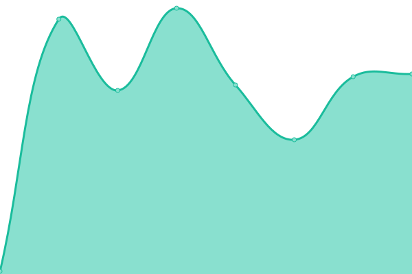
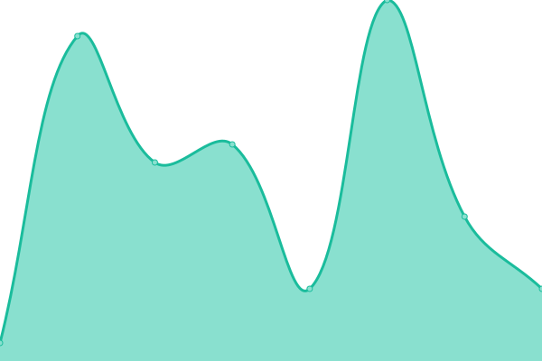
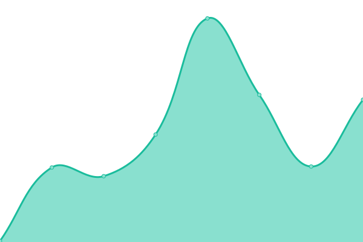
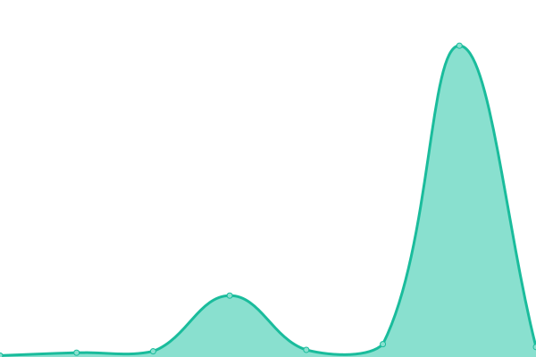

# [📈 Live Status](https://asmur.github.io/quiver): <!--live status--> **🟧 Partial outage**

This repository contains the open-source uptime monitor and status page for [Ashok](https://asmur.github.io/quiver), powered by [Upptime](https://github.com/upptime/upptime).

With [Upptime](https://upptime.js.org), you can get your own unlimited and free uptime monitor and status page, powered entirely by a GitHub repository. We use [Issues](https://github.com/asmur/quiver/issues) as incident reports, [Actions](https://github.com/asmur/quiver/actions) as uptime monitors, and [Pages](https://asmur.github.io/quiver) for the status page.

<!--start: status pages-->
<!-- This summary is generated by Upptime (https://github.com/upptime/upptime) -->
<!-- Do not edit this manually, your changes will be overwritten -->
<!-- prettier-ignore -->
| URL | Status | History | Response Time | Uptime |
| --- | ------ | ------- | ------------- | ------ |
|  [Quiver Login](https://www.quivertheapp.com/login.html#/) | 🟥 Down | [quiver-login.yml](https://github.com/asmur/quiver/commits/HEAD/history/quiver-login.yml) | 

 0ms
     
 | 

<a href="https://asmur.github.io/quiver/history/quiver-login">0.00%</a>
    

|  [Quiver Site](https://www.quivertheapp.com/) | 🟥 Down | [quiver-site.yml](https://github.com/asmur/quiver/commits/HEAD/history/quiver-site.yml) | 

 0ms
     
 | 

<a href="https://asmur.github.io/quiver/history/quiver-site">0.00%</a>
    

|  [PlumbingOwl Site](https://plumbingowl.com/) | 🟩 Up | [plumbing-owl-site.yml](https://github.com/asmur/quiver/commits/HEAD/history/plumbing-owl-site.yml) | 

 106ms
     
 | 

<a href="https://asmur.github.io/quiver/history/plumbing-owl-site">100.00%</a>
    

|  [PlumbingOwl Login](https://plumbingowl.com/login.html#/) | 🟩 Up | [plumbing-owl-login.yml](https://github.com/asmur/quiver/commits/HEAD/history/plumbing-owl-login.yml) | 

 10ms
     
 | 

<a href="https://asmur.github.io/quiver/history/plumbing-owl-login">100.00%</a>
    

<!--end: status pages-->

[**Visit our status website →**](https://asmur.github.io/quiver)

## 📄 License

- Powered by: [Upptime](https://github.com/upptime/upptime)
- Code: [MIT](./LICENSE) © [Ashok](https://asmur.github.io/quiver)
- Data in the `./history` directory: [Open Database License](https://opendatacommons.org/licenses/odbl/1-0/)
